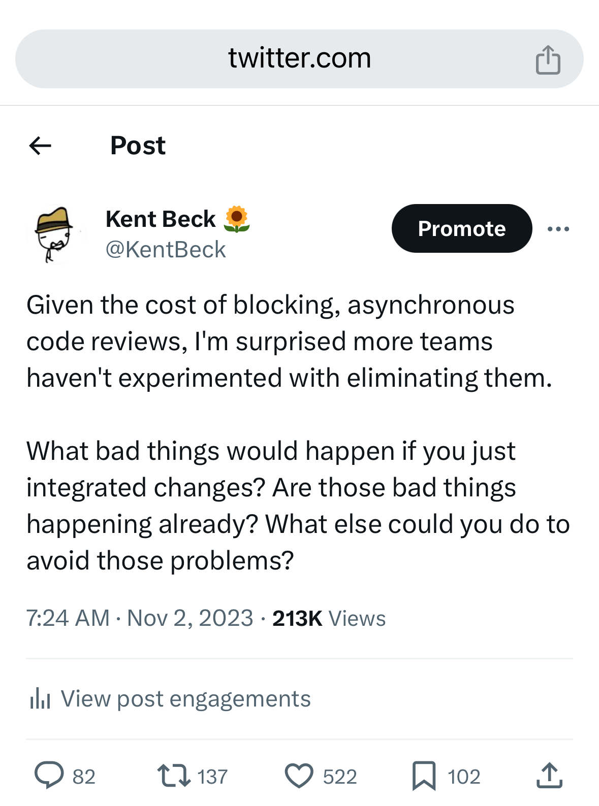

[](https://github.com/RAFSoftLab/code-feed/actions/workflows/ci.yml)
# Code-Feed


Code Feed is a tool that helps teams that are want to use non-blocking pull request reviews.


# Running locally
## 1. Build container
```bash
docker compose up -d
```
## 2. Obtain Gemini API key
When running for the first time, obtain an API key for [Google Gemini model](https://support.gemini.com/hc/en-us/articles/360031080191-How-do-I-create-an-API-key) and paste it into .env file that was created for you.
## 3. Optional - refresh web page automatically
```bash
npm run dev
```
When editing the code, it will automatically refresh the web page.
## 4. Load repository
To load a repository from GitHub, run 
```bash
docker exec -it code-feed-web php artisan app:load-git-repository repository_url
```
 - repository_url: https link such as https://github.com/RAFSoftLab/code-feed-test-repo.git

## Documentation
 - [Functional Requirements](docs/functional-requirements.md)
 - [Sequence diagrams](docs/sequence-diagrams.md)
 - [Prompt engineering](docs/prompt-engineering.md)
 - [Kanban Board](https://github.com/orgs/RAFSoftLab/projects/5)

## License
MIT

