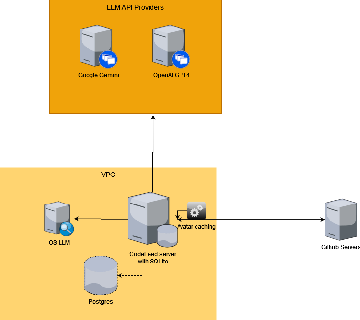
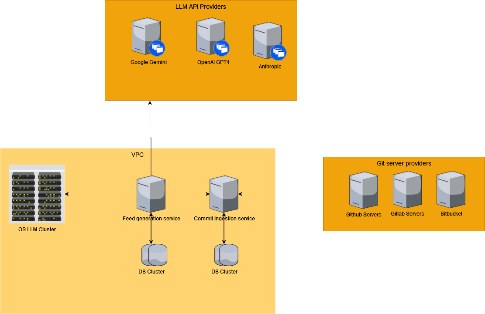
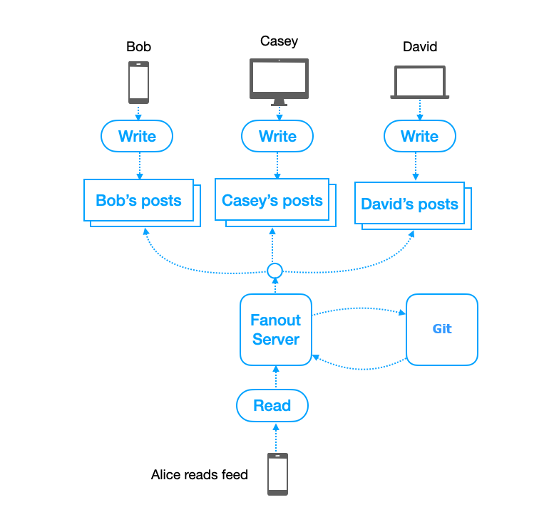
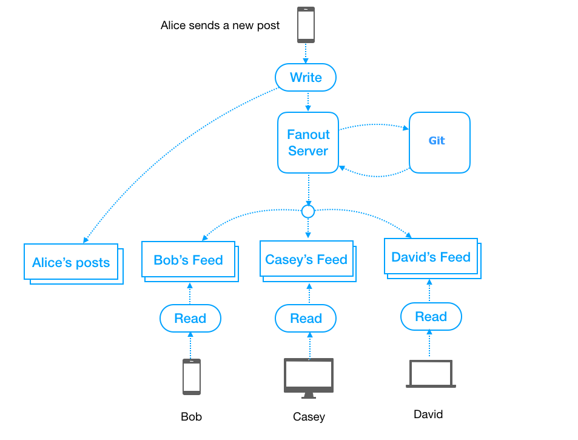

# Architecture
## Current Architecture

## Proposed Architecture

# Feed Fanout Architecture
## Fanout Read architecture

Pros:
1. The cost of write operation is low.
2. Easier to do different aggregation strategies when reading the data.

Cons:
1. The read operation is super costly for a user who has lots of followees.
2. new data can't be shown to the users until they pull.
3. If we periodically pull to fetch latest posts, it's hard to find the right pull cadence and most of the pull requests will result in an empty response, causing waste of resources.

This architecture is better for write-intensive application.

## Fanout Write architecture

Pros:
1. The cost of read operation is low.
 
Cons:
1. The write operation is super costly for a user who has lots of followers.
2. For inactive users or those rarely log in, pre-computing news feeds waste computing resources.

This architecture is better for read-intensive application. Take twitter as example, its readRate >> writeRate. 

For systems have less latency requirement, we can use this approach as well. For example, WeChat Public Accounts do fanout write and all their followers get notified after some latency ranging from seconds to minutes.