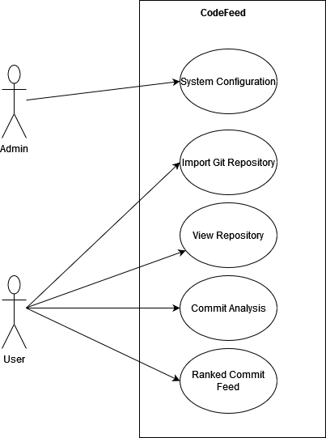

# Functional Requirements
## Proof of Concept
### 1. GIT
 - [x] FR 1.1 Load git repository from web.
 - [x] FR 1.2  Load the complete git history.
 - [x] FR 1.3 Display each commit from history.
 - [x] FR 1.4 Display the list of issues in each commit.
 - [x] FR 1.5 Load new commits as they are created.
 - [x] FR 1.6 Open GitHub commit view for each commit.
 - [x] FR 1.7 Load private repositories from GitHub.
### 2. News(Code)Feed
 - [x] FR 2.1 For each loaded commit, generate a few newsfeed posts that explain what was done.
 - [x] FR 2.2 Apply ranking algorithm to each post.
 - [x] FR 2.3 Display each post in sorted order according to the ranking algorithm.
 - [x] FR 2.3 Personalize news feed for the current user.
### 3. Commit Analysis
 - [x] FR 3.1 Use LLM to infer the summary of each commit.
 - [x] FR 3.2 Use LLM to infer bugs and security issues in each commit.
### 4. User management
- [x] FR 4.1 Implement user login and registration.
- [x] FR 4.2 Implement login via GitHub.
- [x] FR 4.3 Implement admin functionality.
- [x] FR 4.4 User dashboard - show statistics about the current user.
### 5. Server management
- [ ] FR 5.1 Admin should be able to switch between local and remote LLM model.

## Beyond POC
### 1. GIT
 - [ ] FR 1.1 For a commit, find code that was changed by it and load authors.
### 2. News(Code)Feed
 - [ ] FR 2.1 Create posts that convey that somebody changed user's code.
 - [ ] FR 2.2 Create posts that say that somebody removed user's code.
 - [ ] Implement "endless" scrolling in CodeFeed UI.
 - [ ] Add created tasks to the Feed.
 - [ ] Add GitHub issues to the Feed.
 - [ ] Identify failed CI runs for commits and use for ranking.
### 3. Commit Analysis
 - [ ] FR 3.1 FR 2.3 Find additional features for ranking:
     - Bugs
     - Security Issues
     - Code Complexity
     - Size of code
### 5. User Management
 - [ ] Implement user registration via Gitlab.
 - [ ] Implement login via Bitbucket.
 - [ ] Implement teams/organizations management.
 - [ ] Implement inviting team members.
### 6. Task Management
 - [ ] Implement task assignment directly from the CodeFeed UI.